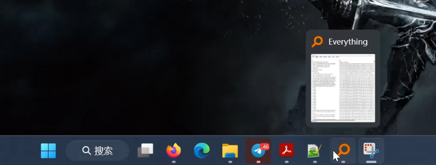
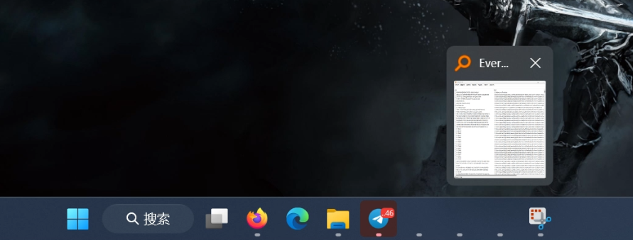

**Software**

Windows 11 Home

**Bug Description**

Sometimes the icons of applications that are not pinned to the taskbar are not displayed on the taskbar.

**Steps to Reproduce**
1. Launch Windows 11 normally.
2. Press the key 'Windows' + 'Tab' to bring up the Task View.
3. Create a second desktop by clicking the plus icon.
4. Click one of the desktop to go into it.
5. Launch some applications that are not pinned on the taskbar on the desktop.
    -  Their icons can display normally after launching. See Screenshot 1.
6. Press the key 'Windows' + 'Tab' or click Task view icon to bring up the Task View again.
7. Click the other desktop to switch to it.
8. Repeat the step 6 and 7 to switch back to the desktop running the apps.
9. Check the icons and see the disapprearance of icons. See See Screenshot 2. 

**Expected behavior**

Icons of running apps must be constantly displayed on the taskbar.

**Screenshots**

1. Before switch

2. After switch 

**Desktop:**
 - OS: [Microsoft Windows 11 Home Chinese version 10.0.22631]

**Additional context**

Report time: 2024-03-29
